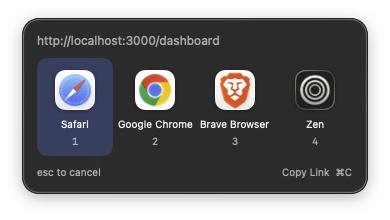

[](https://github.com/warrickbayman/WrangURL/actions/workflows/tests.yml)
[](https://github.com/warrickbayman/WrangURL/releases/latest)

# WrangURL

WrangURL is a macOS menu bar app that opens each link in the right browser. You write rules that match URLs, and WrangURL sends matching links to the browser you choose. If a rule lists more than one browser, a picker lets you choose each time.

> **FULL DISCLOSURE**  
> I am not a Swift developer and wanted a quick solution to this. I found a fiew open source solutions, but really just wanted to experiment with this idea.  
> **WrangURL is built using Claude Code. Details can be found in `PLAN.md` and `CLAUDE.md`**

**If you like this, please consider [sponsoring](https://github.com/sponsors/warrickbayman). It really does help.**

<p align="center">
  
</p>

- Match URLs with simple patterns like `localhost`, `*.example.com` or `github.com/myorg/*`, or with regular expressions.
- Send a match straight to one browser, or choose from a picker when a rule lists several.
- Choose what happens to links no rule matches: open them in a fallback browser, or show the picker.
- Keeps a searchable history of the links it has opened, grouped by day.
- Runs in the menu bar and can open at login.

Requires macOS 14 or later.

## Usage

### First run

On first launch, a short setup assistant asks you to:

1. Choose a **fallback browser** for links that no rule matches.
2. Choose whether unmatched links open in the fallback browser or show the picker.
3. **Set WrangURL as your default browser.** WrangURL can only route links from other apps while it's the default. macOS asks you to confirm.
4. Optionally open WrangURL at login.

You can run the setup again from **Settings → General → Run Setup Again…**.

### Rules

Open **Edit Rules…** from the menu bar icon. Each rule has a pattern and one or more browsers. Rules are checked from top to bottom and the first match wins, so drag rules to reorder them.

**Simple patterns** match the host and, optionally, the scheme, port and path:

| Pattern | Matches |
|---|---|
| `localhost` | `localhost` over http or https, on any port |
| `http://localhost` | `localhost` over http only |
| `localhost:3000` | `localhost` on port 3000 only |
| `*.example.com` | `example.com` and all of its subdomains |
| `github.com/myorg/*` | URLs on `github.com` whose path starts with `/myorg/` |

Simple patterns ignore case. A path matches as a prefix, and `*` is a wildcard.

**Regular expressions** can match anywhere in the full URL. They're case-sensitive; start the pattern with `(?i)` to ignore case.

To check your rules, use **Test a URL** at the bottom of the Rules tab. It shows which rule matches and which browser would open. The rule editor has its own test field for the rule you're editing.

### The browser picker

The picker appears next to the mouse pointer. The app you clicked the link in stays in front.

| Key | Action |
|---|---|
| `1`–`9` | Open in that browser |
| `←` `→` or `Tab` | Move the selection |
| `Return` | Open in the selected browser |
| `⌘C` | Copy the link and close the picker |
| `Esc` or click elsewhere | Cancel |

### History

Choose **History…** in the menu to see every link WrangURL has opened, grouped by day, with the time, the rule that matched and the browser it went to. Search filters by URL, browser or rule. The buttons at the end of each row copy the link or open it again through your rules; double-clicking also opens it again. Right-click to copy, open or delete selected links. The trash button in the toolbar clears everything.

History is kept only on this Mac, in `history.json` next to the configuration file, and holds the most recent 5,000 links. Turn it off in **Settings → General**.

### Settings and configuration

- **Settings → General** covers the fallback browser, what to do with unmatched links, launch at login, updates, whether URLs appear in the system log, whether to keep a history, and the default browser status.
- WrangURL checks GitHub for new releases with [Sparkle](https://sparkle-project.org). Choose **Check for Updates…** in the menu to check now.
- If WrangURL stops being the default browser, the menu bar icon changes to ⚠︎.
- **Import… and Export…** save and load your rules and settings as JSON.
- Your configuration is stored in `~/Library/Containers/com.thepublicgood.wrangurl/Data/Library/Application Support/WrangURL/config.json`. After editing the file by hand, click **Reload** in Settings → General.

## Building

You'll need:

- Xcode 26 or later
- [XcodeGen](https://github.com/yonaskolb/XcodeGen), which generates the Xcode project from `project.yml`: `brew install xcodegen`

```sh
xcodegen generate
open WrangURL.xcodeproj
```

The generated `WrangURL.xcodeproj` isn't checked in. Run `xcodegen generate` again after adding or removing files, or after changing `project.yml`.

To build from the command line:

```sh
xcodebuild -project WrangURL.xcodeproj -scheme WrangURL -configuration Release -derivedDataPath build/DerivedData -skipPackagePluginValidation build
```

SwiftLint runs as part of the build, with its rules in `.swiftlint.yml`. `-skipPackagePluginValidation` lets its build plugin run from the command line; in Xcode, click **Trust & Enable** the first time you build.

The app is written to `build/DerivedData/Build/Products/Release/WrangURL.app`. Debug and local builds are ad-hoc signed, so they run on your own Mac without a certificate.

When you set a development build as your default browser, macOS records the path of that particular copy. After moving or deleting it, set the default browser again.

### Releasing

Publishing a GitHub release runs `.github/workflows/release.yml`. It builds the app, re-signs it with a self-signed certificate (`scripts/resign.sh`) so every release has the same code signing identity, and attaches it to the release as a zip, along with the Sparkle `appcast.xml` that installed copies check for updates. The release notes become the update notes. The workflow needs the `SPARKLE_PRIVATE_KEY` repository secret. That's the EdDSA private key whose public half is `SUPublicEDKey` in `project.yml`. Export it with Sparkle's `generate_keys --account wrangurl -x <file>`. It also needs `SIGNING_CERTIFICATE_P12` (the base64-encoded "WrangURL Self-Signed" identity, exported from Keychain Access as a .p12) and `SIGNING_CERTIFICATE_PASSWORD`. The build number is the workflow run number, so each release is newer than the one before it.

`scripts/release.sh` builds a signed, notarized app and DMG in `build/release/`. It needs:

- A **Developer ID Application** certificate in your keychain.
- Notarization credentials saved once with:

  ```sh
  xcrun notarytool store-credentials WrangURL --apple-id <your Apple ID> --team-id <your team ID>
  ```

Set `SKIP_NOTARIZE=1` to build and sign without notarizing. There are more details at the top of the script.

## Testing

Run the tests from Xcode with **⌘U**, or from the command line:

```sh
xcodebuild -project WrangURL.xcodeproj -scheme WrangURL -derivedDataPath build/DerivedData -skipPackagePluginValidation test
```

The tests use Swift Testing. They cover:

- pattern matching
- routing decisions
- saving, loading and importing the configuration
- keyboard handling in the picker

While hosting the tests, the app skips its startup actions, so it doesn't open windows or change your configuration.

## License

WrangURL is released under the MIT License. See [LICENSE.md](LICENSE.md).

---

Copyright © 2026 Warrick Bayman.
